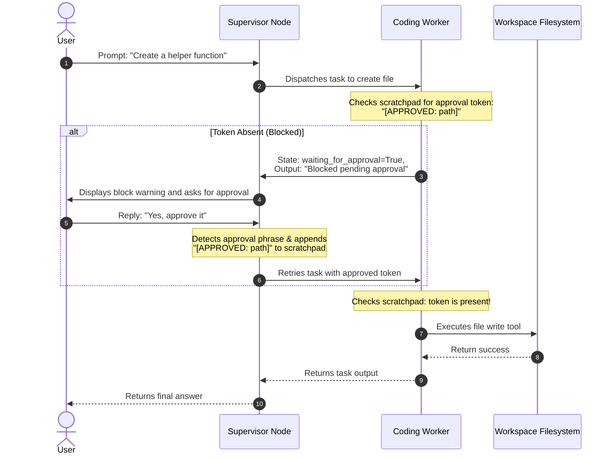
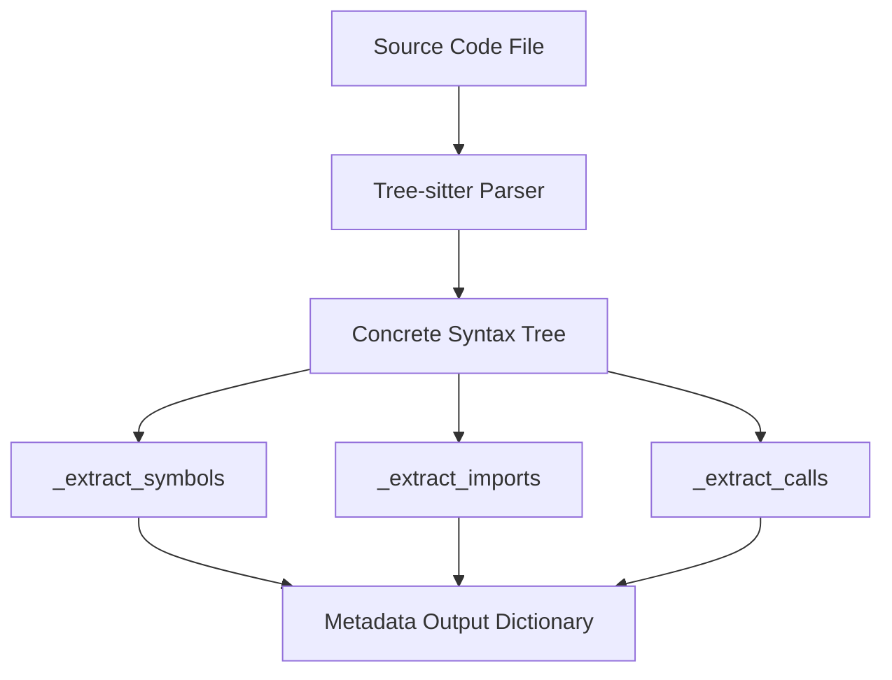

# Code Intelligence: Syntax Validation, HITL Approval, and Tree-Sitter Integration

This document outlines three core engineering patterns implemented in the RAG multi-agent codebase:
1. **Syntax Validation** (compilation and sanity checks)
2. **Human-in-the-Loop (HITL) Approval Flow** (securing state modifications)
3. **Tree-Sitter Parsing Integration** (robust multi-language parsing)

---

## 1. Syntax Validation

The syntax validation system is designed to catch coding errors in-memory *before* they are applied to files or checked in. This protects the repository from syntax regressions.

### Implementation Details
- **Location**: [validation.py](file:///c:/Users/vasan/Documents/Apphelix%20Intern/RAG/src/core/code/validation.py)
- **Key Function**: `validate_syntax(code_content: str, filename: str) -> Tuple[bool, str]`

### How it Works
1. **File Type Filtering**: The system checks the file extension. Currently, it skips syntax checks for non-Python files, immediately returning `True`.
2. **In-Memory Compilation**: For Python files, it invokes Python's built-in `compile()` function in `exec` mode:
   ```python
   compile(code_content, filename, "exec")
   ```
   No bytecode is executed, and no state changes are made to the running environment.
3. **Error Handling**:
   - If compile succeeds: Returns `(True, "Syntax compilation successful.")`.
   - If a `SyntaxError` is raised: Captures detailed context, including the error message, line number, and column offset, returning `(False, err_msg)`.

> [!TIP]
> This validation is called by `dry_run_and_validate_patch` within the coding worker to ensure that generated diff patches do not introduce syntax errors when applied.

---

## 2. Human-in-the-Loop (HITL) Approval Flow

To maintain repository safety, the multi-agent system enforces a **read-only policy** by default. Any tools that make state-modifying actions (`create_files`, `modify_files`, `delete_file`) are intercepted and require explicit human verification.

### System Components
- **Coding Agent**: [coding_worker.py](file:///c:/Users/vasan/Documents/Apphelix%20Intern/RAG/src/agents/coding_worker.py)
- **Supervisor Agent**: [supervisor.py](file:///c:/Users/vasan/Documents/Apphelix%20Intern/RAG/src/graph/supervisor.py)
- **Verification Tests**: [test_cooperative_flow.py](file:///c:/Users/vasan/Documents/Apphelix%20Intern/RAG/tests/multi_agent/test_cooperative_flow.py)

### The HITL Process Flow



### Technical Workflow Details

1. **Permission Check**: Before running `create_files`, `modify_files`, or `delete_file`, the coding worker checks if the token `[APPROVED: <filepath>]` is present in the cooperative `scratchpad`.
2. **State Suspension**: If the token is missing:
   - The action is suspended.
   - The worker stores the request metadata in a global `_pending_approvals` directory.
   - The worker returns `waiting_for_approval: True` with the specific `approval_filepath` and `approval_tool`.
3. **Approval Detection**: On the subsequent turn, the supervisor node scans the user's input for common approval keywords (e.g., `approve`, `yes`, `ok`, `go ahead`, `apply`, `proceed`, `yep`, `sure`).
4. **Token Injection**: If approval is detected, the supervisor adds `- [SYSTEM]: User has approved changes: [APPROVED: <filepath>]` to the scratchpad.
5. **Execution**: The coding worker runs again, finds the approval token in the scratchpad, executes the file operation, and continues.

---

## 3. Tree-Sitter Parser Implementation

To upgrade from Python's standard `ast` parsing, the codebase implements **Tree-sitter** for robust, incremental, and multi-language parsing.

### Implementation Details
- **Location**: [parser.py](file:///c:/Users/vasan/Documents/Apphelix%20Intern/RAG/src/core/code/parser.py)
- **Key API**: `parse_code_file(filepath: str, language: str = "python") -> Dict[str, Any]`
- **Required Libraries**: `tree-sitter`, `tree-sitter-python` (version `>=0.21.0`)

### Parser Architecture
When analyzing a file, Tree-sitter generates a Concrete Syntax Tree (CST) that the code parser walks to extract structured metadata.



### Extracted Metadata Types
The parser extracts three main categories of structural information:

| Metadata Type | Internal Function | Extracted Elements |
|---|---|---|
| **Symbols** | `_extract_symbols` | Class names, docstrings, parent classes, bases, methods, and functions (with args/type annotations and return types). |
| **Imports** | `_extract_imports` | Standard imports (`import x`) and from-imports (`from x import y`), including line numbers. |
| **Calls** | `_extract_calls` | Method and function calls (e.g., `obj.method()`), mapping line numbers. |

### Robust Fallback System
If the Tree-sitter module or language library is missing or fails to import, the parser automatically switches to an Abstract Syntax Tree (AST) fallback:

```python
try:
    result = _parse_with_tree_sitter(content, filepath, language)
    return result
except ImportError as e:
    logger.warning(f"Tree-sitter not available, falling back to ast: {e}")
    return _parse_with_ast_fallback(filepath, language)
```

> [!NOTE]
> The AST fallback (`_parse_with_ast_fallback`) only supports **Python** files, whereas the Tree-sitter pipeline is built to easily scale to other languages (such as JavaScript, TypeScript, etc.) by declaring language module mappings.

---

## 4. Under-the-Hood: Techniques & Frameworks

To achieve the features detailed above, the codebase relies on a combination of standard libraries, modern agentic libraries, and specialized parsing frameworks.

### Syntax Validation Techniques & Tools
- **In-Memory Compilation (`compile()` built-in)**: Rather than spawning heavy subprocesses or writing intermediate files to disk to validate syntax, the system leverages Python's built-in compiler interface to parse the source tree in-memory via `compile(code_content, filename, "exec")`.
- **Patch Dry-Run Validation (`patch` patching algorithm)**: The system applies diff-patch structures in memory using a custom Python implementation of the unified diff patching algorithm to validate code modifications before they impact the filesystem.

### Human-in-the-Loop (HITL) Frameworks & Architectural Patterns
- **LangGraph Orchestration (`langgraph`)**:
  - **StateGraph & Bounded Control**: Manages the agent routing nodes (`supervisor_node`, `coding_worker_node`, `code_critic_worker_node`) via a state machine.
  - **Workflow Pauses and Interrupts**: Employs LangGraph's conditional routing to terminate the graph with `END` when `waiting_for_approval` is detected, pausing execution for user input.
  - **Memory Checkpointing (`MemorySaver`)**: Persists graph state history under a `thread_id` so the execution context (including scratchpad findings and messages) is preserved between the user's block notification and their subsequent approval/command.
- **Cooperative Blackboard Architectural Pattern**: A shared dictionary state (`scratchpad`, `worker_outputs`, `worker_complete`) is used as a blackboard where agents read context, post outputs, and coordinate task delegation.
- **Groq LLM Bindings (`langchain_groq.ChatGroq`)**: Interacts with Groq LLMs utilizing:
  - **Tool Bindings (`bind_tools`)**: Exposes system modification tools to the model.
  - **Structured JSON Routing Outputs (`with_structured_output`)**: Parses supervisor decisions into strict `SupervisorDecision` Pydantic models for reliable state transition.
- **Regex Parsing (`re`)**: Employs Python's standard `re` module to dynamically extract pending file paths from logs/scratchpads.
- **In-Memory Session Approval Store**: Utilizes a thread-safe dict caching layer (`_pending_approvals`) to store pending file change payloads between user turns.

### Tree-Sitter Parser Frameworks & Patterns
- **Tree-sitter Ecosystem (`tree-sitter`, `tree-sitter-python`)**: Incremental parsing system that builds a Concrete Syntax Tree (CST) from source text, providing robust multi-language structural representation.
- **Concrete Syntax Tree (CST) Walking**: Utilizes recursive tree-walking routines (`_extract_symbols`, `_extract_imports`, `_extract_calls`) traversing tree-sitter nodes to pull definitions, parameters, annotations, and references.
- **Graceful AST Fallback (`ast`)**: Uses Python's standard `ast` module as a zero-dependency fallback, ensuring symbol retrieval remains functional even if Tree-sitter bindings are not installed on the host machine.
- **Dynamic Library Imports (`__import__()`, `getattr()`)**: Dynamically resolves and loads external language modules (e.g. `tree_sitter_python`) on-demand, reducing memory footprints and allowing extensibility.

