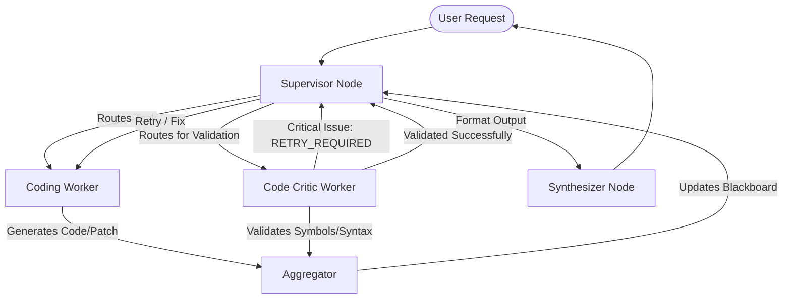

# Novice-friendly Guide: How the RAG Multi-Agent Coding System Works

Welcome! This document provides a gentle introduction to the architecture, packages, frameworks, and workflows used to build the coding agent in this repository.

---

## 1. High-Level Architecture (The Multi-Agent Graph)

Instead of having a single AI model try to do everything, this system uses a **Multi-Agent Cooperative Architecture**. It divides responsibilities among specialized workers coordinated by a central supervisor.

Think of it like a software development team:
* **The Project Manager (Supervisor)**: Receives the client request, drafts a plan, selects the best worker for the job, and checks their progress.
* **The Developers & Researchers (Workers)**: Specialized agents (e.g., Coding Specialist, Document Retriever, Web Searcher) who perform specific actions and report back.
* **The QA Tester (Code Critic)**: Reviews the developer's work, checks for syntax errors or security risks, and flags it for correction if something is wrong.

### How it Flows (Mermaid Sequence)

---

## 2. Core Frameworks & Key Packages

Here are the tools and packages that make this system work, broken down by their purpose:

| Package / Framework | Role in System | Novice Analogy |
| :--- | :--- | :--- |
| **LangGraph** | Orchestrates the agent workflow, loops, and state changes. | The **map and rules** of the office indicating who passes work to whom. |
| **LangChain Core** | Provides message types (`HumanMessage`, `AIMessage`, etc.) and tools framework (`@tool`). | The **common language** and templates the workers use to talk to each other. |
| **ChatGroq (`langchain-groq`)** | Connects to the high-speed Groq inference cloud to run Llama-3.1 models. | The **brain power** fueling the intelligence of the agents. |
| **Weaviate** | A vector database used for semantic search. | The **search index** of library bookshelves, letting agents find context by meaning. |
| **AST (Abstract Syntax Trees)** | Parsers code structure natively in Python. | A **code dictionary** listing every class, function, and parameter in the repo. |
| **psutil & subprocess** | Executes tests and commands safely while monitoring memory, CPU, and time limits. | A **sandbox play-pen** letting developers run code without harming the host computer. |
| **SQLite (via Python's `sqlite3`)** | Stores conversation history and session details persistently. | The **archive cabinet** preserving conversation logs. |

---

## 3. How the Coding Agent Works (Step-by-Step)

The coding agent ([coding_worker.py](file:///c:/Users/vasan/Documents/Apphelix Intern/RAG/src/agents/coding_worker.py)) has a restricted set of capabilities to read, write, edit, and analyze code inside the `./workspace` folder. 

When a coding task is assigned:

### Step 1: Tool Binding & Pruning
To stay within memory limits and keep reasoning fast, the system checks the complexity of the user query:
* **Simple Queries** (e.g., "delete a file"): The agent is bound to basic file tools (`read_files`, `create_files`, `modify_files`, `delete_file`).
* **Complex Queries** (e.g., "analyze dependency call graph"): The agent is bound to all symbol, call-graph, and code intelligence tools.

### Step 2: The Agentic Loop
The worker initiates a loop (up to 5 steps, executing up to 10 tool calls):
1. **Invoke LLM**: The LLM reads the task and decides if it needs information (e.g., list files or read a symbol definition).
2. **Call Tool**: If the LLM generates a tool call (e.g., `list_files`), the agent executes the tool function and receives the result.
3. **Feed Output**: The tool output is appended to the conversation history as a `ToolMessage`.
4. **Repeat**: The LLM evaluates the new information and decides if it is done or needs another tool.

### Step 3: Enforcing Safety Boundaries
All tool calls are sanitized and validated by [coding_tools.py](file:///c:/Users/vasan/Documents/Apphelix Intern/RAG/src/tools/coding_tools.py):
* **Workspace Isolation**: Paths are strictly checked. If an agent tries to use `../` to access files outside `./workspace`, or read sensitive keys, the path guard blocks the action.
* **Execution Limiters**: When running pytest or code compiles, `psutil` monitors resource usage. If a command runs forever (infinite loop), uses more than 100MB of RAM, or uses more than 5 seconds of CPU time, it is forcibly terminated.

---

## 4. How Code Critic Validates and Recovers

Once the Coding Specialist is done, the supervisor routes the result to the **Code Critic Worker** ([code_critic_worker.py](file:///c:/Users/vasan/Documents/Apphelix Intern/RAG/src/agents/code_critic_worker.py)) for a quality assurance check.

### 1. Verification Checklist
The critic does not write code. Instead, it reviews what the Coding worker did using structured validation models:
* **Hallucination Detection**: It queries the repository's AST index to check if any class/method referenced by the coding worker actually exists.
* **Syntax Compilation**: It runs an in-memory compilation check (`compile()`) on any edited code to ensure there are no missing colons, invalid indentations, or syntax errors.
* **Security Scanning**: It checks the diffs for hardcoded passwords, SQL injection patterns, or path traversal issues.

### 2. The Retry Flow (`RETRY_REQUIRED`)
If the Critic finds a critical failure (e.g., the code doesn't compile or references a function that doesn't exist):
1. The critic marks the report `valid = False`.
2. The critic appends a special token: `RETRY_REQUIRED` to its response.
3. The critic appends a correction step to the plan: `"FIX ERROR: Review code critic feedback..."`.
4. The supervisor reads the updated plan, sees that a correction is needed, and routes the task **back to the coding worker** with the critic's report so it can fix the issues.

This create-criticize-repair cycle keeps the system resilient and ensures the agent writes functional code!
